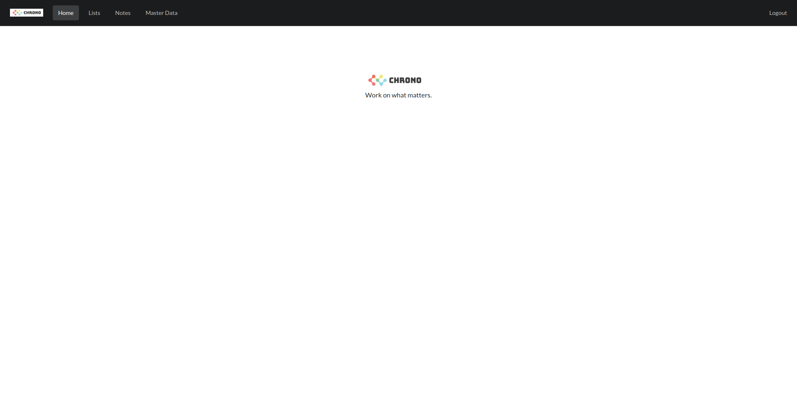
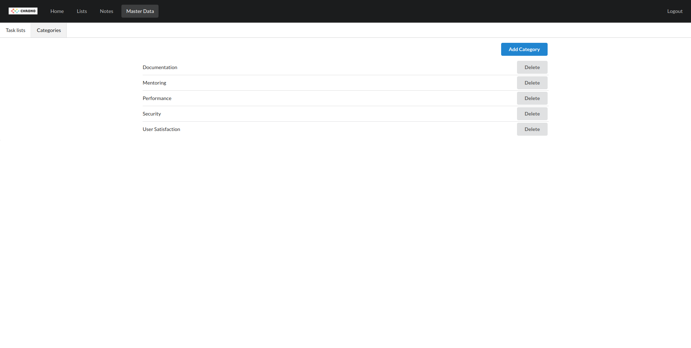
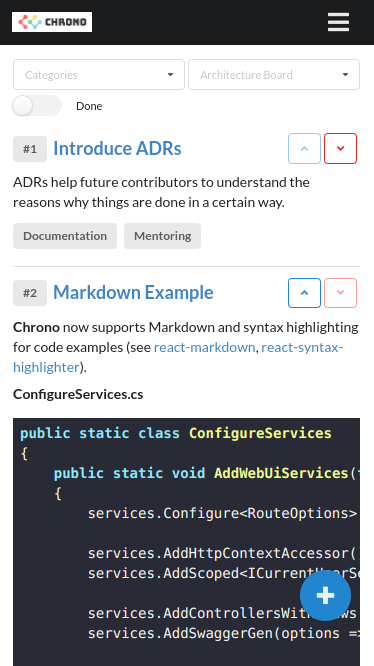

<p align="center">
  
</p>

---

[](https://github.com/philipp-meier/Chrono/actions/workflows/dotnet.yml)
[](https://codescene.io/projects)
[](https://github.com/philipp-meier/Chrono/blob/main/LICENSE)

A simple self-hostable (business) value centric application to organize and priorize ideas / tasks across multiple teams or projects.

This application was inspired by the [staffeng.com](https://staffeng.com/guides/work-on-what-matters/) blog and is a simple tool to keep track of useful ideas that positively impact your project(s) and therefore - _work on what matters_.

## Current features

- Manage task categories (e.g. "Quality Improvement", "Time Saving", "Documentation", "Security"...).
- Manage task lists (e.g. "Team 1", "Team 2", "Architecture Board",...).
- Manage tasks (rank, categorize, describe business value / impact,...).
- Audit features (created, last modified).
- Filtering (done, category, task list,...).
- Responsive for smaller devices (e.g. mobile phones and tablets).
- Multi-user capable with OpenID Connect authentication.
- **Why**-centric for maximizing impact.
- Follows security best-practices.

## Preview (23th June 2023)

### Home



### List


### Adding tasks


### Master Data



### Mobile



## Getting started

You will need an empty `sqlite3`-database in the `data`-folder of the project. For this you can execute the following command:

```sh
sqlite3 chrono.db "VACUUM;"
```

Besides the database, you also need an OAuth provider like [auth0](https://auth0.com) and configure the `Authority`, `ClientId` and `ClientSecret` in the `appsettings.json` file of the `WebUI` project.

Once that is done, you can run the application with (for example) `dotnet watch` in the `WebUI` folder.

**Swagger UI**: https://localhost:7151/swagger/index.html

## Useful scripts

```sh
sqlite3 chrono.db "VACUUM;"
dotnet ef migrations add Initial --project ../Application/Application.csproj --startup-project WebUI.csproj
dotnet ef database update --project ../Application/Application.csproj --startup-project WebUI.csproj
```

## Technology

- **Backend**: ASP.NET Core Web API
- **Frontend**: React with Semantic UI
- **Tools / Extensions**: Editorconfig, Prettier
